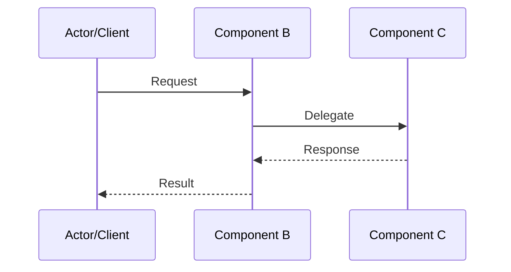
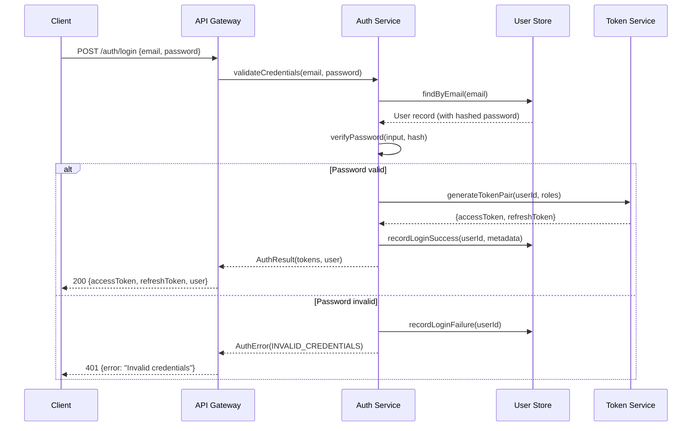
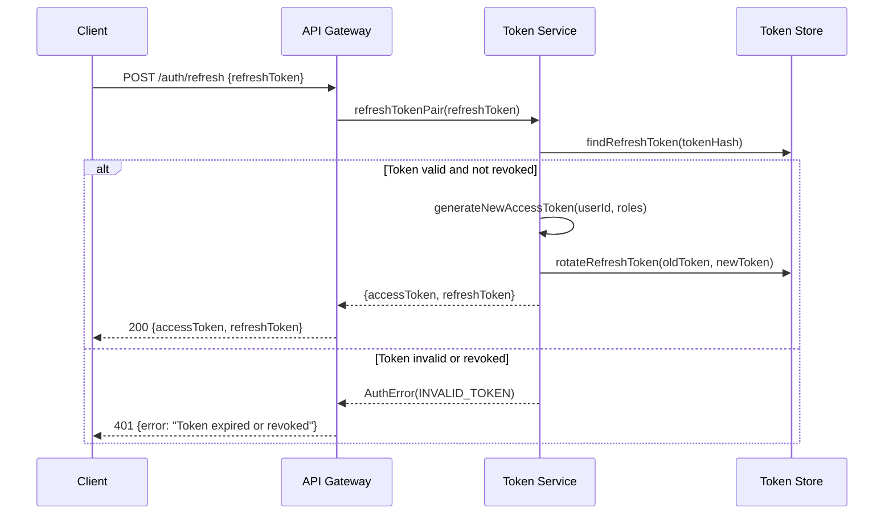
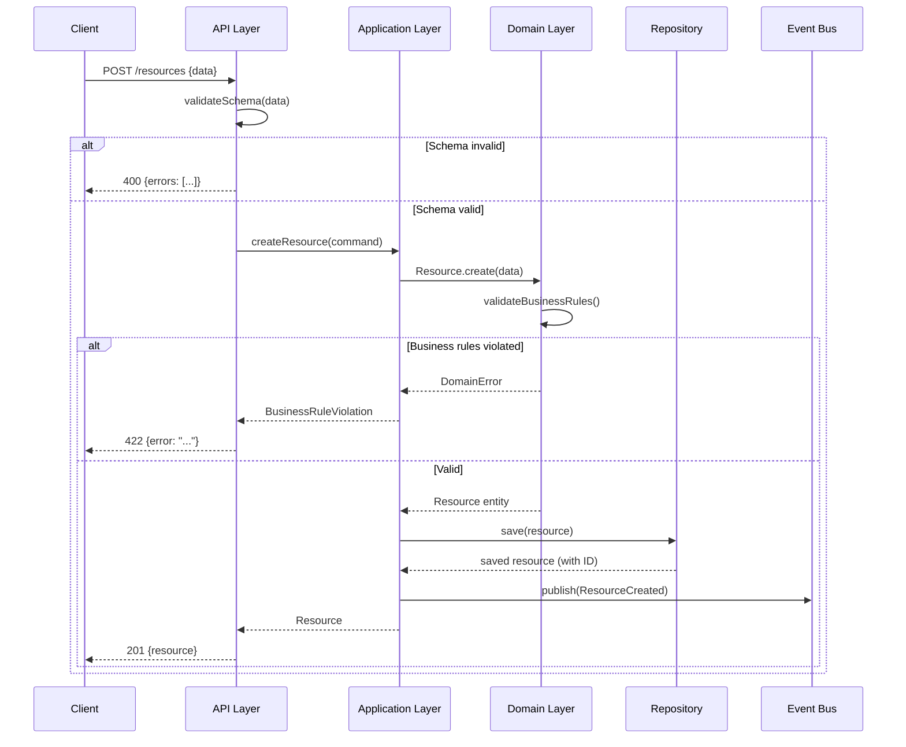
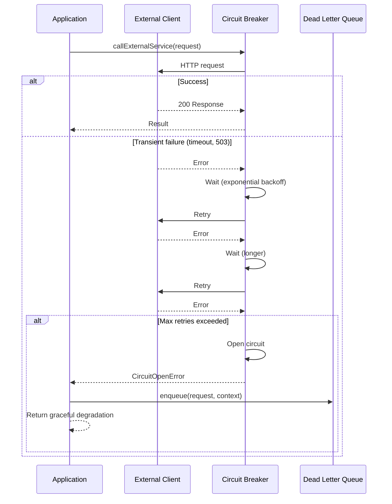
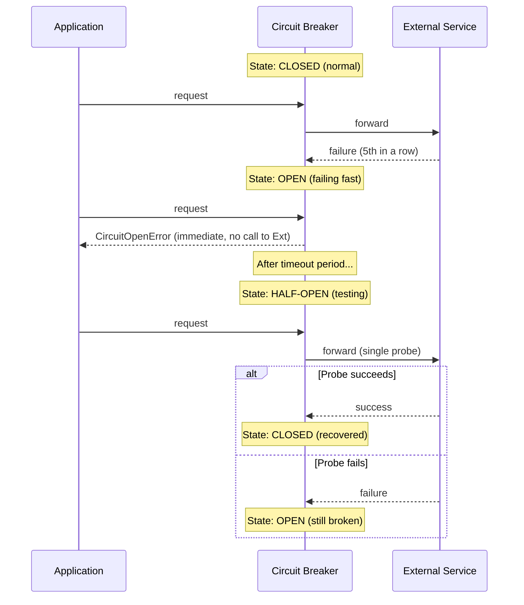
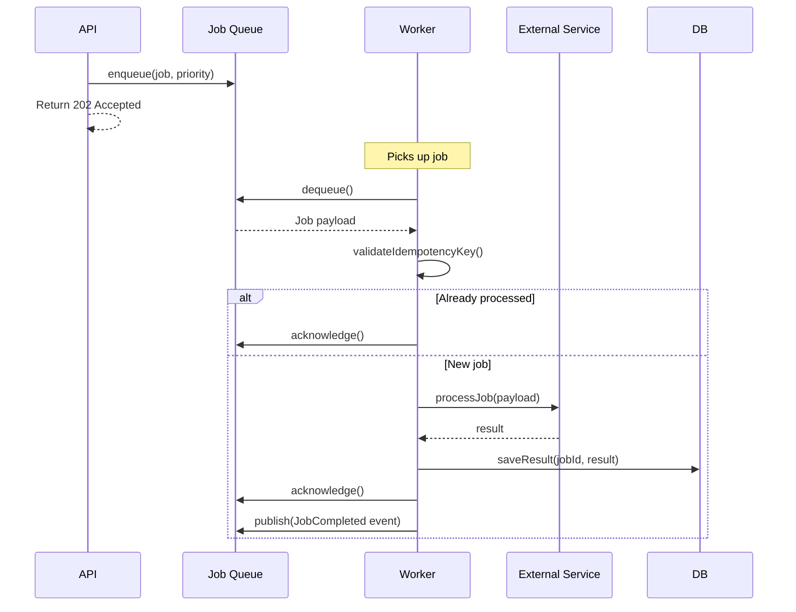
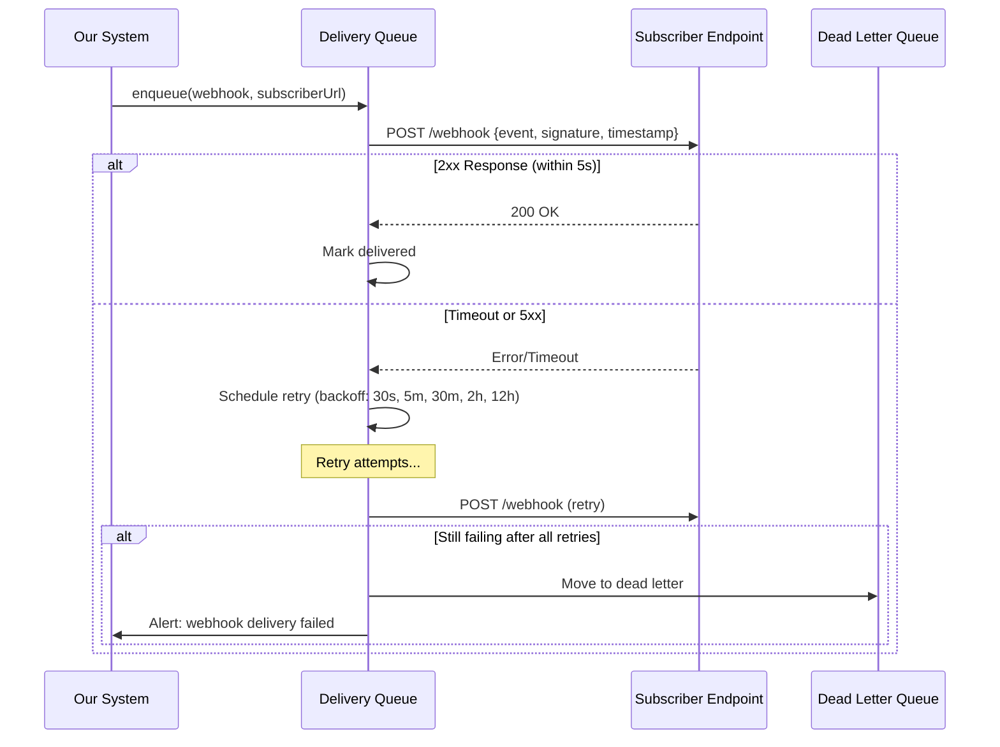
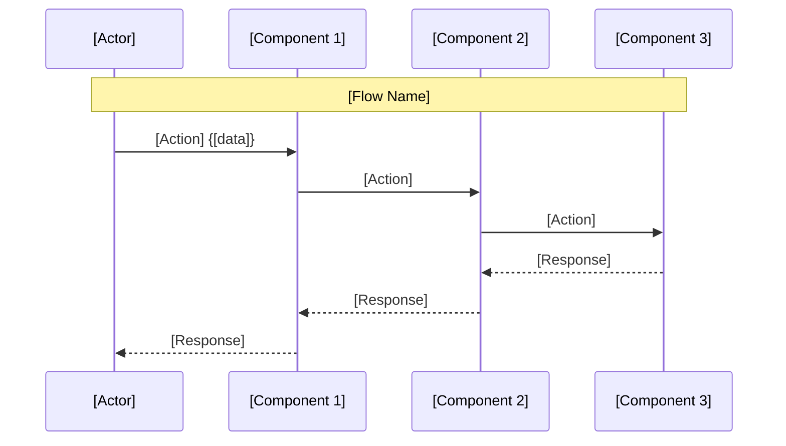

# Sequence Diagrams

Sequence diagrams document the runtime behavior of key flows. They show which components interact, in what order, and what data passes between them.

---

## When to Create Sequence Diagrams

- Authentication/authorization flows
- Core business operations (create, purchase, process)
- Error handling and recovery flows
- Multi-service interactions
- Any flow that spans more than 2 components

---

## Diagram Format

Use Mermaid syntax for maintainability:

---

## 1. Authentication Flow

### Login (Username/Password)

### Token Refresh

---

## 2. Data Creation Flow

### Create Resource (with validation)

---

## 3. Error Handling Flow

### Transient Failure with Retry

### Circuit Breaker States

---

## 4. Async Processing Flow

### Background Job Execution

---

## 5. Webhook Delivery Flow

---

## Diagram Conventions

| Symbol | Meaning |
|--------|---------|
| `->>` | Synchronous request |
| `-->>` | Response |
| `--)` | Asynchronous message (fire and forget) |
| `alt/else` | Conditional branches |
| `opt` | Optional interaction |
| `loop` | Repeated interaction |
| `Note over` | Annotation |

---

## Template for New Diagrams

